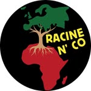

# Carte interactive Du Fastoche 5 de Racine N'CO

Bienvenue ! Petite présentation de notre Fastoche ...

---

## Affiche du Fastoche

---

## Carte du Fastoche

<iframe src="https://racinenco-prog.github.io/fastoche5/map/index.html" width="100%" height="600px"></iframe>

---
---

## Lien vers la Carte

[Cliquez ici pour voir la carte interactive](https://racinenco-prog.github.io/fastoche5/map)

---

## Technos

- [QGIS](https://qgis.org/)
- Plugin [qgis2web](https://github.com/tomchadwin/qgis2web)
- HTML / JavaScript / Leaflet.js ou OpenLayers (selon ton export)
- GitHub Pages

---

## Auteur

@RacineN'co

---

## Licence 

!()[https://upload.wikimedia.org/wikipedia/commons/thumb/d/d5/BeerWare_Logo.svg/250px-BeerWare_Logo.svg.png]

/*
* ----------------------------------------------------------------------------
* "LICENCE BEERWARE" (Révision 42):
* <phk@FreeBSD.ORG> a créé ce fichier. Tant que vous conservez cet avertissement,
* vous pouvez faire ce que vous voulez de ce truc. Si on se rencontre un jour et
* que vous pensez que ce truc vaut le coup, vous pouvez me payer une bière en
* retour. Poul-Henning Kamp
* ----------------------------------------------------------------------------
*/
